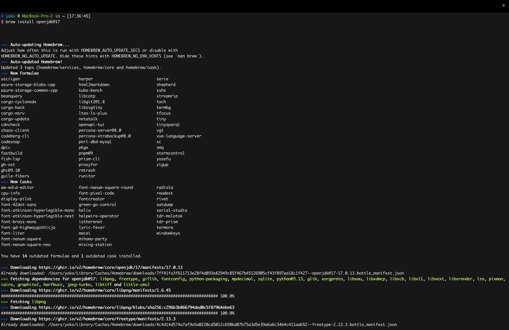
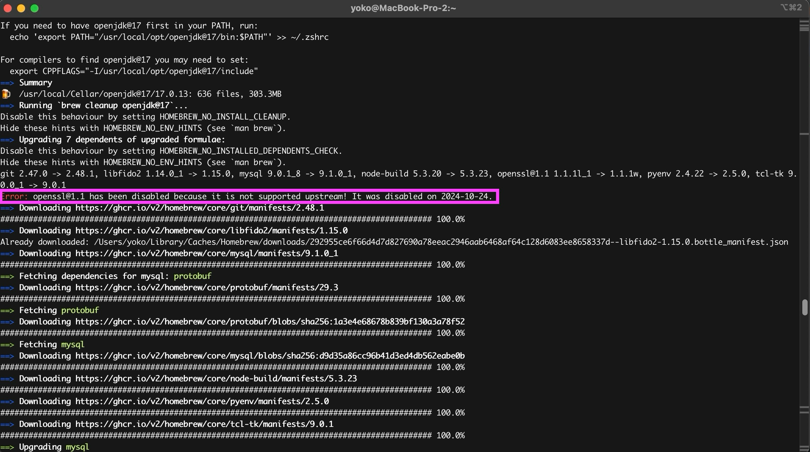

## Java17をインストールする

Java 17 はLTS（長期サポート版）なので、現在のJava 21をアンインストールする必要はない。
Java 17を別途インストールして切り替えるのが良い。

```
brew reinstall openjdk@17
```



エラー
openssl@1.1がサポート終了のため無効化されたことが関連している可能性がある。



openssl@1.1が無効化されているため、次の代替バージョンを使用する。
最新バージョンのopenssl@3をインストール
```agsl
brew install openssl@3
```

依存関係を整理
brew doctorは、システム状態をチェックし、問題の修正方法を提案してくれる。
```agsl
brew cleanup
brew doctor
```

再度openjdk@17をインストール。
```agsl
brew install openjdk@17
```

### 環境変数の設定
openjdk@17のパスを環境変数に設定

パスの確認
```agsl
/usr/libexec/java_home -V
```

環境変数を設定
```agsl
echo 'export JAVA_HOME=$(/usr/libexec/java_home -v 17)' >> ~/.zshrc
source ~/.zshrc
```
